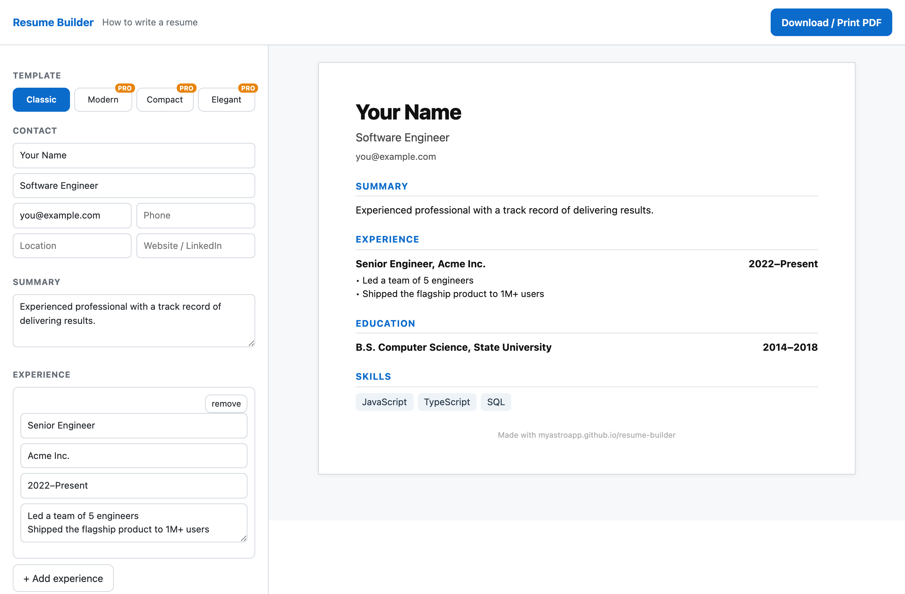

# Free Resume Builder

Build a clean, professional resume and download it as a PDF in minutes — free, no sign-up, runs entirely in your browser.

**▶ Use it: https://myastroapp.github.io/resume-builder/**

## Features
- Live preview as you fill in contact, summary, experience, education, and skills
- Add/remove experience and education entries
- One-click **Download / Print to PDF**
- 100% private — your resume data never leaves your device; no accounts, no tracking
- One-time **Pro** unlocks 3 more professional templates (Modern, Compact, Elegant) and a clean no-footer PDF — one-time, not a subscription

No watermark on the content, no sign-up, no data collection.

## More free tools
- [JSON & developer tools](https://myastroapp.github.io/json-viewer/) — viewer, formatter, converters, JWT, Base64, regex, and more
- [Finance calculators](https://myastroapp.github.io/rental-calculator/) — rental property, mortgage, affordability, payoff
- [Invoice / estimate / receipt generator](https://myastroapp.github.io/invoice-generator/) — free, no sign-up
